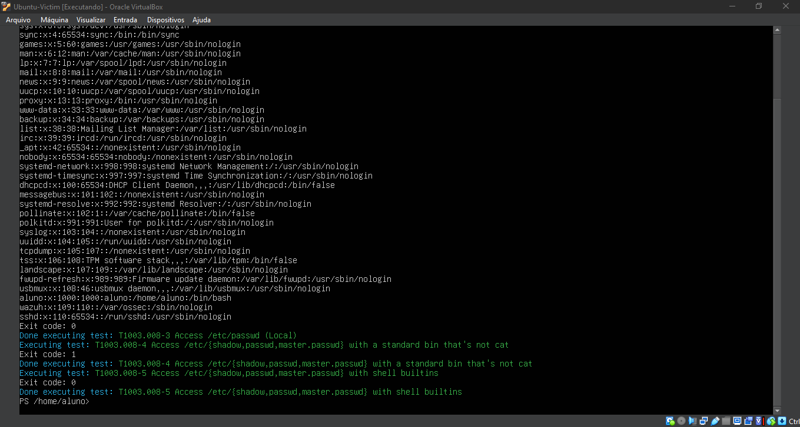
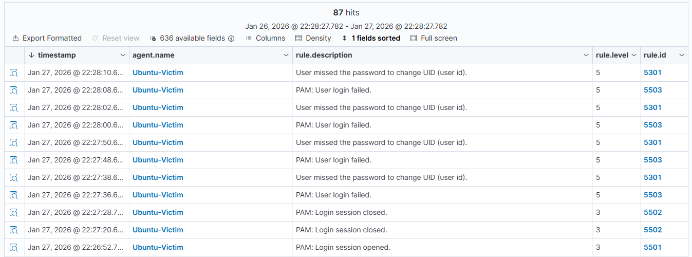
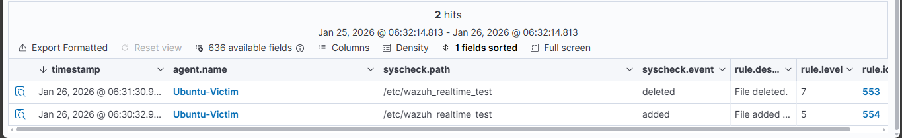
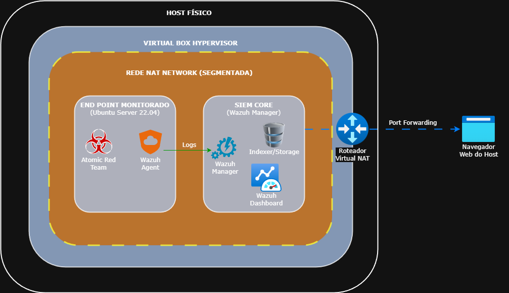

# 🛡️ Threat Detection Lab: Emulação de Adversário & SIEM

## 📋 Resumo Executivo
Projeto prático focado em **Engenharia de Detecção de Ameaças** (Threat Detection Engineering). O objetivo principal foi implementar uma infraestrutura de monitoramento de segurança (SIEM) capaz de detectar Técnicas, Táticas e Procedimentos (TTPs) reais, mapeados na matriz **MITRE ATT&CK**.

Diferente de labs tradicionais focados apenas em invasão, este projeto utiliza a metodologia de **Adversary Emulation** (Emulação de Adversário) com o framework **Atomic Red Team**, garantindo testes de segurança controlados, repetíveis e com foco na eficácia da defesa (Blue Team).

---

## 🏗️ Arquitetura do Projeto

A infraestrutura foi desenhada para simular um ambiente corporativo segmentado, garantindo segurança durante os testes de malware e exploração.

* **SIEM Core:** Wazuh Manager (Running on VirtualBox).
* **Endpoint Monitorado:** Ubuntu Server 22.04 LTS.
* **Adversary Emulation:** Atomic Red Team (Bash/PowerShell Core on Linux).
* **Rede:** Segmentação via NAT Network com Port Forwarding (Porta 4443) para acesso seguro ao dashboard via Host.

### Tecnologias Utilizadas
| Categoria | Tecnologia | Função |
| :--- | :--- | :--- |
| **Monitoramento** | Wazuh v4.14.2 | SIEM & XDR para coleta, correlação e análise de logs. |
| **OS** | Ubuntu Server 22.04 | Servidor alvo da simulação (Victim). |
| **Framework** | Atomic Red Team | Biblioteca de testes atômicos mapeados no MITRE. |
| **Automação** | PowerShell Core | Executor dos testes no ambiente Linux. |

---

## 🕵️ Cenários de Teste e Detecção (MITRE ATT&CK)

Este laboratório focou na validação de regras de detecção para as seguintes técnicas:

### 1. T1003.008 - OS Credential Dumping (/etc/shadow)
**Cenário:** Simulação de um atacante tentando obter acesso root para ler o arquivo de hashes de senha (`/etc/shadow`).
* **Comando Executado (Atomic Red Team):** `Invoke-AtomicTest T1003.008`
* **Evidência da Execução:**

* **Detecção no Wazuh:**
> *Nota: O SIEM detectou as tentativas de força bruta e falha de autenticação associadas à tentativa do atacante de elevar privilégios para acessar o arquivo protegido.*

### 2. T1070.004 - Indicator Removal: File Deletion
**Cenário:** O atacante tenta apagar seus rastros deletando arquivos de logs ou payloads.
* **Comando Executado:** `Invoke-AtomicTest T1070.004`
* **Detecção:** Regra customizada de FIM (File Integrity Monitoring) disparada em tempo real.
* **Evidência da Execução:**

---

## 🚀 Como Reproduzir este Lab

### Pré-requisitos
* VirtualBox 7.2.4
* Imagem OVA do Wazuh 4.14.2
* Ubuntu Server ISO

### Instalação e Configuração Resumida
1.  **Deploy do Wazuh:** Importação da OVA e configuração de rede estática na faixa `10.0.2.x`.
2.  **Preparação do Endpoint:** Instalação do Wazuh Agent no Ubuntu e pareamento com o Manager.
3.  **Tuning:** Habilitação do modo `realtime="yes"` no arquivo `ossec.conf` para monitoramento crítico.
4.  **Setup do Atomic Red Team:** Instalação do PowerShell Core e do módulo `Invoke-AtomicRedTeam`.

> *Nota: Para um guia passo a passo detalhado, consulte o arquivo [`docs/lab-setup-guide.md`](./docs/lab-setup-guide.md).*

---

## 👨‍💻 Desafios Enfrentados & Troubleshooting

Durante a implementação, o principal desafio foi a **visibilidade de rede versus isolamento**.
* **Problema:** A Rede NAT isolava as VMs da rede doméstica (para segurança), mas impedia meu acesso ao Dashboard Web do Wazuh.
* **Solução:** Implementação de uma regra de **Port Forwarding** no VirtualBox, mapeando a porta local `4443` para a porta `443` do contêiner do Wazuh. Isso permitiu gerenciamento via navegador sem expor as VMs à rede externa.

---

## 💡 Conclusão e Aprendizados
A implementação do Atomic Red Team permitiu validar a eficácia das regras padrão do Wazuh.
* **Insight Técnico:** Percebi que regras padrão de FIM (File Integrity Monitoring) possuem um delay de varredura (syscheck frequency). Para ambientes críticos, o ajuste fino para monitoramento em tempo real (`realtime`) é obrigatório.
* **Resultado:** Após o tuning, o tempo médio de detecção (MTTD) para acesso ao `/etc/shadow` caiu para menos de 5 segundos.
